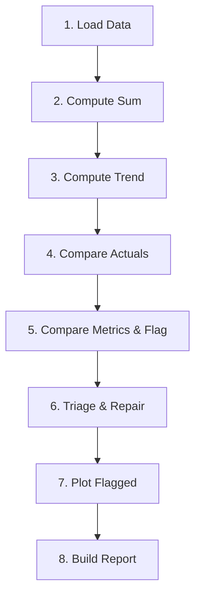

# Strategic Forecast Comparison Agent — Architecture Guide

## Overview

The **Strategic Forecast Comparison Agent** is a LangGraph-style agentic system that compares two forecast files, identifies anomalies, diagnoses root causes, and attempts to repair divergent forecasts using statistical models.

**Architecture Pattern**: TypedDict State + Node Functions + Sequential Graph Runner

---

## 🏗️ System Architecture

### State Management

The agent maintains a centralized `AgentState` dataclass that flows through all nodes:

```python
@dataclass
class AgentState:
    df1, df2                    # Input dataframes (V1 and V2)
    pred_col_v1, pred_col_v2    # Forecast column names
    hierarchies                 # Shared dimension combinations
    sum_metrics                 # Total forecast sums
    trend_metrics               # Linear trend slopes
    actuals_metrics             # Historical actuals comparison
    comparison_df               # Final comparison with flags
    repair_results              # Triage and repair outcomes
    plot_paths                  # Generated diagnostic plots
    summary                     # Final report text
    errors                      # Error log
```

### Processing Pipeline (8 Nodes)



---

## 📊 What is Done by **Scripts & Thresholds** (Rule-Based)

### 1️⃣ **Node 1: Load Data** — Pure Script Logic
**What it does:**
- Reads two CSV files (`STRATEGIC_FORECAST_SNOWFLAKE.csv`, `purina_ea_feb.csv`)
- Normalizes data:
  - Filters to `Scenario 0` only
  - Removes `MANUAL_INPUT ≠ 0` rows
  - Drops irrelevant columns (`TIMESTAMP`, `UOM`, `UNIT_INITIAL`)
  - Detects forecast column (`PREDICTION` or `FORECAST_UNIVARIATE`)
  - Limits to first **60 months** of forecast horizon
  - Converts dates to **quarterly periods**
  - Sums STATUS sub-rows to hierarchy grain
- Identifies shared hierarchies: `[AGG_REGION, REGION, RANGE_BRAND_NAME, GA1_NAME]`

**Thresholds:** None  
**LLM Role:** None  

---

### 2️⃣ **Node 2: Compute Sum** — Pure Script Logic
**What it does:**
- For each hierarchy, extracts forecast values **positionally** (no date join)
- Computes total sum: `sum_v1`, `sum_v2`
- Counts forecast periods: `n_periods_v1`, `n_periods_v2`

**Thresholds:** None  
**LLM Role:** None  

---

### 3️⃣ **Node 3: Compute Trend** — Pure Script Logic
**What it does:**
- Calculates linear slope of forecast series using `scipy.stats.linregress`
- Returns `slope_v1`, `slope_v2` (forecast direction and acceleration)

**Thresholds:** None  
**LLM Role:** None  

---

### 4️⃣ **Node 4: Compare Actuals** — Script with Threshold
**What it does:**
- Extracts historical actuals from both files (date-aligned)
- Computes `actuals_sum_v1`, `actuals_sum_v2`, `actuals_diff_pct`
- Flags `actuals_changed = True` if diff exceeds threshold
- Determines direction: `up`, `down`, `stable`

**Thresholds:**
```python
ACTUALS_DIFF_PCT_THRESHOLD = 5.0  # % change to flag actuals as "changed"
```

**LLM Role:** None  

---

### 5️⃣ **Node 5: Compare Metrics & Flag** — Script + LLM Root Cause

#### **Rule-Based Flagging**
Flags anomalies using three criteria:

| Flag | Condition | Threshold |
|------|-----------|-----------|
| `flag_sum` | `abs(sum_diff_pct) > threshold` | `5.0%` |
| `flag_trend_sign` | Trend direction reversal | N/A (boolean) |
| `flag_trend_mag` | `abs(slope_diff_pct) > threshold` | `20.0%` |

**Any flagged hierarchy triggers LLM-based root-cause analysis.**

**Thresholds:**
```python
SUM_DIFF_PCT_THRESHOLD     = 5.0   # Sum must differ by >5% to flag
TREND_DIFF_PCT_THRESHOLD   = 20.0  # Slope must differ by >20% to flag
ACTUALS_DIFF_PCT_THRESHOLD = 5.0   # Actuals must differ by >5% to mark "changed"
```

#### **🤖 LLM Integration Point #1: Root Cause Analysis**

**Current State:** LLM-enabled (always on)  
**Implementation:**

```python
from huggingface_hub import InferenceClient
client = InferenceClient(model="meta-llama/Meta-Llama-3-8B-Instruct", token=HF_TOKEN)
response = client.chat_completion(messages=[...], max_tokens=150)
```

**LLM Prompt Structure:**
```
You are a forecasting analyst reviewing a flagged hierarchy.

Hierarchy: [region/brand/product]
Forecast sum V1: 12345
Forecast sum V2: 15678
Forecast sum diff: +27.0%
Trend slope V1: 45.2
Trend slope V2: -12.3
Trend sign flipped: True
Actuals sum V1: 11500
Actuals sum V2: 11520
Actuals diff: +0.2%
Actuals changed significantly: False

In one sentence, what is the most likely root cause of this forecast change?
```

**LLM Decision:** Generates natural language root cause (replaces rule-based verdict)

---

### 6️⃣ **Node 6: Triage & Repair** — Script with Threshold + Model Selection

#### **Triage Logic (Rule-Based)**

```
FOR each flagged hierarchy:
    IF actuals_changed == True AND abs(actuals_diff_pct) > 5.0:
        → UNREPAIRABLE (data mismatch, not a model issue)
    
    ELIF insufficient history (< 8 quarters):
        → REPAIRABLE → DEFAULT (no repair attempted)
    
    ELSE:
        → REPAIRABLE → Attempt model-based repair
```

#### **Model-Based Repair (Script + Threshold)**

**Process:**
1. Extract V1 actuals (training data)
2. Fit 3 candidate models:
   - **ARIMA(0,1,1)** — integrated moving average
   - **ETS (Holt-Winters)** — exponential smoothing with trend + seasonality
   - **Seasonal Naive** — repeat last cycle
3. Forecast `n_periods` into the future
4. Compute MAPE (Mean Absolute Percentage Error) vs V2 target
5. Select best model **only if** it improves over V1 baseline by ≥10%

**Thresholds:**
```python
ACTUALS_DIFF_PCT_THRESHOLD = 5.0   # Above this → UNREPAIRABLE
REPAIR_IMPROVEMENT_MIN     = 0.10  # Model must beat baseline MAPE by ≥10%
SEASON                     = 4     # Quarterly periodicity
```

**Outcome:**
- `TRIAGE`: `UNREPAIRABLE` / `REPAIRABLE` / `OK`
- `REPAIR_MODEL`: `ARIMA(0,1,1)` / `ETS` / `SEASONAL_NAIVE` / `DEFAULT`
- `REPAIR_MAPE`: Winning model MAPE
- `BASELINE_MAPE`: V1 forecast MAPE (before repair)

**LLM Role:** None (purely statistical model selection)

---

### 7️⃣ **Node 7: Plot Flagged** — Pure Script Logic

**What it does:**
Generates 3-panel diagnostic plots for each flagged hierarchy:

| Panel | Content | X-Axis | Y-Axis |
|-------|---------|--------|--------|
| 1 | Forecast overlay (V1, V2, Repaired) | Period index | Forecast value |
| 2 | Actuals overlay (V1, V2) | Date | Actuals value |
| 3 | Period-by-period % diff (V2 vs V1) | Period index | % diff |

**Output:** PNG files saved to `outputs/` directory

**Thresholds:** None  
**LLM Role:** None  

---

### 8️⃣ **Node 8: Build Report** — Script + LLM Executive Summary

**What it does:**
- Counts hierarchies by status: `OK`, `FLAGGED`, `UNREPAIRABLE`, `REPAIRABLE`
- Counts root causes: `ACTUALS_DRIVEN`, `MODEL_CHANGE`, `STRUCTURAL_SHIFT`, etc.
- Writes two-sheet Excel report:
  - **Sheet 1:** All hierarchies
  - **Sheet 2:** Flagged only (UNREPAIRABLE first)

#### **🤖 LLM Integration Point #2: Executive Summary**

**Current State:** LLM-enabled (always on)  
**Implementation:**

```python
prompt = f"""Forecasting analyst report: {flagged}/{total} hierarchies flagged 
comparing {state.label_v1} vs {state.label_v2}. 
Root causes: {root_counts}. 
Triage: {unrepairable} unrepairable, {repaired} repaired, {default} defaulted. 
Write a concise 3-sentence executive summary."""

verdict = client.chat_completion(messages=[{"role": "user", "content": prompt}], 
                                 max_tokens=300).choices[0].message.content
```

**LLM Decision:** Generates natural language executive summary (1-3 sentences)

---

## 🤖 Agent Decisions: Rule-Based vs LLM

| Decision Point | Implementation | Approach |
|----------------|----------------|----------|
| **Anomaly Flagging** | ✅ Rule-based thresholds | Thresholds are domain-specific and auditable |
| **Root Cause Diagnosis** | 🤖 **LLM classifies root cause** | Synthesizes multiple signals into business language |
| **Triage (Repairable?)** | ✅ Rule-based (actuals delta) | Data quality checks require deterministic logic |
| **Model Selection** | ✅ Statistical (MAPE minimization) | Empirical validation (MAPE) is objective |
| **Executive Summary** | 🤖 **LLM generates narrative** | Translates metrics into stakeholder-friendly insights |

---

## 🔧 Configuration & Thresholds

### File Paths
```python
FILE_1 = "STRATEGIC_FORECAST_SNOWFLAKE.csv"
FILE_2 = "purina_ea_feb.csv"
OUTPUT_XLS = "outputs/forecast_comparison_report.xlsx"
PLOTS_DIR = "outputs"
```

### Hierarchy Dimensions
```python
HIERARCHY = ["AGG_REGION", "REGION", "RANGE_BRAND_NAME", "GA1_NAME"]
```

### Column Names
```python
ACT_COL = "ACTUALS"
IGNORE_COLS = {"TIMESTAMP", "UOM", "UNIT_INITIAL"}
```

### Flagging Thresholds
```python
SUM_DIFF_PCT_THRESHOLD     = 5.0   # Forecast sum must differ by >5%
TREND_DIFF_PCT_THRESHOLD   = 20.0  # Trend slope must differ by >20%
ACTUALS_DIFF_PCT_THRESHOLD = 5.0   # Actuals must differ by >5% (unrepairable)
```

### Repair Parameters
```python
REPAIR_IMPROVEMENT_MIN = 0.10  # Model must beat baseline MAPE by ≥10%
SEASON = 4                     # Quarterly data (4 periods/year)
```
---

## 📈 Output Artifacts

### 1. Excel Report (`forecast_comparison_report.xlsx`)
**Sheet 1: All Hierarchies**
- All dimension combinations analyzed
- Columns: `sum_v1`, `sum_v2`, `sum_diff_pct`, `slope_v1`, `slope_v2`, `actuals_diff_pct`, `FLAGGED`, `FLAG_REASON`, `ROOT_CAUSE`, `TRIAGE`, `REPAIR_MODEL`, `REPAIR_MAPE`, `BASELINE_MAPE`

**Sheet 2: Flagged Only**
- Sorted by `TRIAGE` (UNREPAIRABLE first)
- Same columns as Sheet 1

### 2. Diagnostic Plots (`outputs/*.png`)
- One 3-panel plot per flagged hierarchy
- Panel 1: Forecast comparison (positional alignment)
- Panel 2: Actuals history (date-aligned)
- Panel 3: Period-by-period % difference

### 3. Console Summary
```
=================================================================
  FORECAST COMPARISON + REPAIR REPORT
=================================================================
  V1 : STRATEGIC_FORECAST_SNOWFLAKE
  V2 : purina_ea_feb
  Hierarchies analysed : 150
  OK                   : 120
  FLAGGED              : 30
  -- UNREPAIRABLE      : 5
  -- REPAIRABLE        : 25
     -- model fixed    : 18
     -- DEFAULT        : 7
  -- Actuals Driven              : 12
  -- Model Change                : 8
  -- Structural Shift            : 5
  -- Mixed Signal                : 3
  -- Minor Drift                 : 2
  Plots saved          : 30 -> outputs
=================================================================
```

---

## 🎯 Key Design Principles

### 1. **Hierarchical Grain Preservation**
- All computations at `[AGG_REGION, REGION, RANGE_BRAND_NAME, GA1_NAME]` grain
- Sub-STATUS rows summed during load to avoid double-counting

### 2. **Positional vs Date-Based Joins**
- **Forecasts:** Positional alignment (no date join) — assumes same sequence
- **Actuals:** Date-aligned join — validates historical data consistency

### 3. **Threshold-Driven Flagging**
- Conservative thresholds (5% sum, 20% trend) to avoid false positives
- Actuals threshold (5%) separates data quality issues from model drift

### 4. **Model Selection as Last Resort**
- Only attempts repair if actuals are stable (`actuals_diff_pct < 5%`)
- Requires 10%+ improvement over baseline to accept model forecast

### 5. **LLM as Interpreter, Not Decider**
- LLM explains *why* (root cause narrative)
- Rules decide *what* (flag/repair/pass)

---

## 🧠 When to Use LLM vs Rules

| Task | Best Approach | Reason |
|------|---------------|--------|
| Anomaly detection | **Rules** | Thresholds are domain-specific and auditable |
| Root cause narrative | **LLM** | Synthesizes multiple signals into business language |
| Triage logic | **Rules** | Data quality checks require deterministic logic |
| Model selection | **Statistical** | Empirical validation (MAPE) is objective |
| Executive summary | **LLM** | Translates metrics into stakeholder-friendly insights |

---

## 📚 References

- **LangGraph Pattern:** [LangChain Blog](https://blog.langchain.dev/langgraph/)
- **HuggingFace Inference API:** [Documentation](https://huggingface.co/docs/api-inference/)
- **ARIMA/ETS Models:** `statsmodels` library

---

## 🚀 Future Enhancements

1. **Multi-Model Ensemble:** Combine ARIMA + ETS predictions with learned weights
2. **Hierarchical Forecasting:** Reconcile GA1_NAME forecasts to RANGE_BRAND_NAME totals
3. **Causal Inference:** Detect external shocks (promotions, supply chain) via actuals spikes
4. **Drift Detection:** Track forecast bias over time (MAPE by quarter)
5. **Interactive Dashboard:** Streamlit UI for drill-down analysis

---

*Agent Version: 2.0 (LangGraph-style, LLM-enabled)*  
*Last Updated: 2026-03-11*
